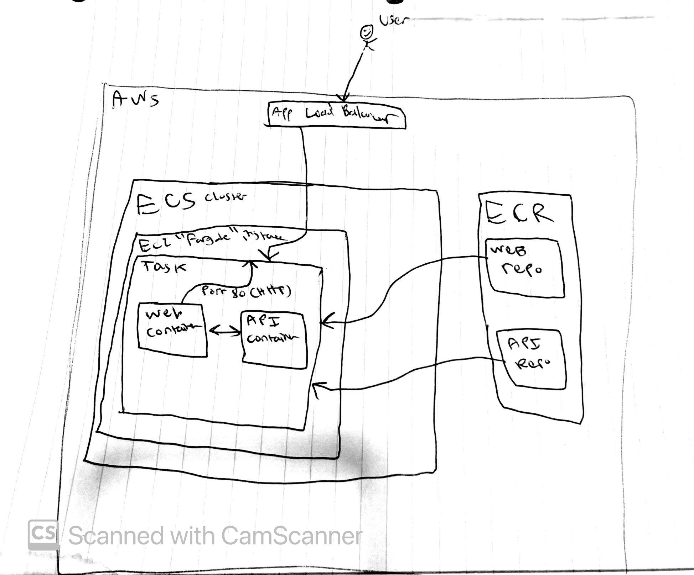
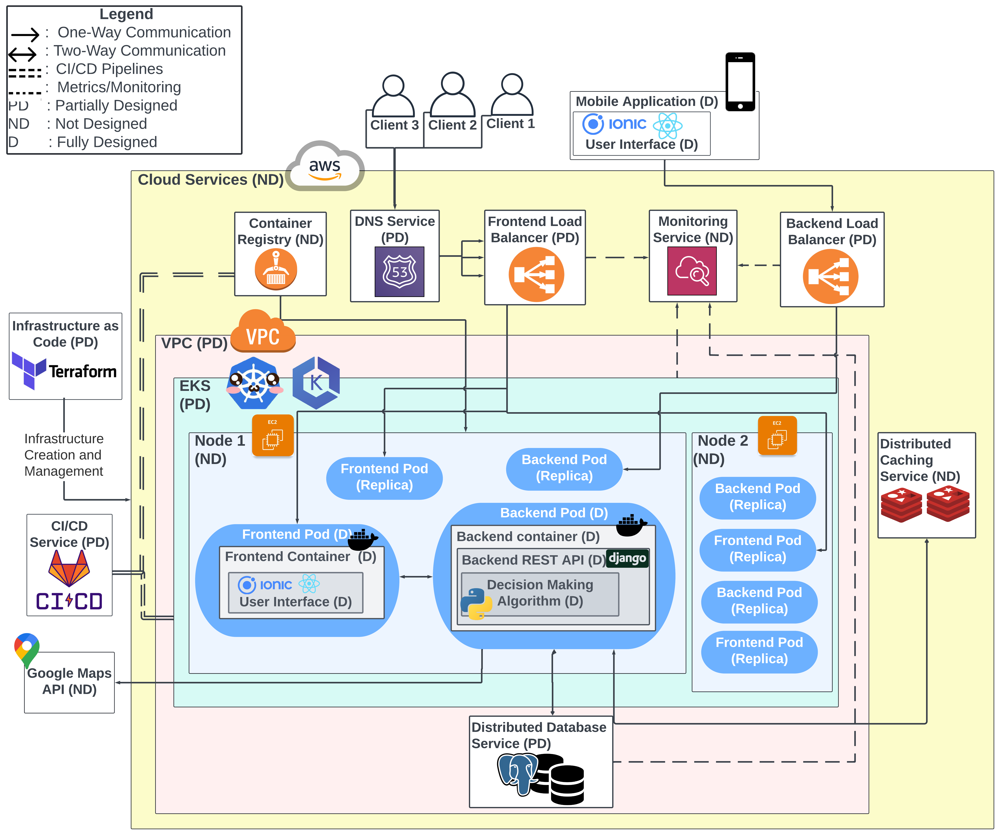

# Notes from Ahmad
This is my first time dealing with Pulumi in this much detail and it was a great learning experience since I have only ever seen quickstart guides and played around with very simple things for proof of concepts and lunch n learns. No matter what the outcome is here, this was an interesting take home challenge and it is nice to see one that is relevant to the role.

Since this is a more proper first time with Pulumi, I don't have much idea on best practices and real world examples (especially since I am learning this all on the fly) so how things are laid out is probably a little ugly and not nice.

The ECS deploy uses fargate and leverages what pulumi called 'aws crosswalk' which is really incredible since it automatically creates a lot of boilerplate resources like security groups and listeners for load balancers, so you don't have to define a bunch of things yourself, seems really useful and cool.

Tagging resources on AWS is also something I never really paid as much attention to in either Terraform code or browsing resources on the console, there are defintiely best practices but I am not aware of how they are applied. 

Overall I think the solution(s) I provided are far from ideal and definitely not perfect (and might not even work if actually applied and resources created) but it was a good learning experience nonetheless, and taught me a good bit more about pulumi. 

## Updates:
Updated the ECS deploy to use a custom VPC and configured a secuirty group to allow http access to the fargate service on ECS.

# Deployments
there exists both `pulumi-ecs` and `pulumi-eks` folders in which all the Pulumi deployments are. I decided to have both for the sake of learning more about Pulumi since this was a good opportunity to look into both since I was learning about container orchestration infrastructure with Pulumi for this assessment anyway. As usual, `pulumi up` should do everything in one fell swoop when in either of the folders. 

It is worth noting that I did not try to actually run and create the resources for these out of fear of incurring costs on AWS, though `pulumi preview` runs as expected with no errors.

# Diagram

This is a fairly basic-ish diagram outlining the infrastructure at play here in the ECS case. A user accesses the load balancer endpoint, which points to the EC2 'fargate' instance, which is inside the ECS cluster, inside this instance we have a task running which comprises of the web and api containers, where port 80 of the web container is exposed. These containers are defined in the task definition, where the images of the containers are pulled from the respective ECR repositories. 

## Update with custom VPC for the ECS deploy:
similar to the original diagram except the services and load balancer are contained within the VPC, and a NAT gateway allows things within the VPC to be accessed by the outside world.

The EKS case is very similar except everything is inside a defined VPC, and the cluster would instead have EC2 instances as nodes, and inside the nodes you would have the api and web pods (there are also replica pods), where inside these pods the container is running. The web pod would be accessible to the outside (though a nat gateway is also required) but the pod with the api container would just communicate within the cluster.

The diagram was drawn by hand since, from experience, making a nice diagram is very time consuming (as I learnt from a school project where I was in charge of the cloud infrastructure). Though here is what a 'nicer' EKS diagram would look like (not related to this weather application though), which is from that very school project (which also includes DNS):

